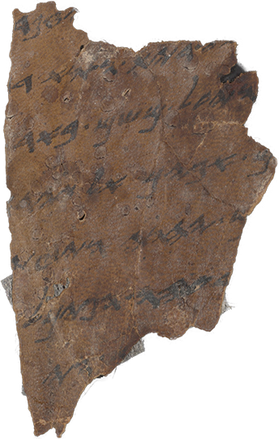

# deathrip [](https://crates.io/crates/deathrip)



> The Dead Sea Scrolls are ancient Jewish and Hebrew religious manuscripts that were found in the Qumran Caves in the Judaean Desert, near Ein Feshkha on the northern shore of the Dead Sea in the West Bank; the last scrolls discovered were found in the Cave of Horror in Israel.
> 
> Created: Est. 408 BCE to 318 CE
>
> &horbar; [Wikipedia](https://en.wikipedia.org/wiki/Dead_Sea_Scrolls)


A command-line tool to download full-resolution Dead Sea Scroll images by their ID or URL in [The Dead Sea Scrolls Digital Library](https://www.deadseascrolls.org.il/).

Accept the library's [terms of service](https://www.deadseascrolls.org.il/terms) before usage.

# Installation

You can install with `cargo`:
```bash
cargo install deathrip
```

Or on Windows download the latest [release](https://github.com/yehuthi/deathrip/releases).

# Usage
Simple usage:
```ps1
deathrip <page URL | item ID> [-o <destination>.<"png"|"jpg">]
```

E.g.
```bash
# Equivalent:
deathrip https://www.deadseascrolls.org.il/explore-the-archive/image/B-314643
deathrip B-314643

# With destination:
deathrip B-314643 -o ten_commandments.jpg
```

For more usage information, run with `--help`.
